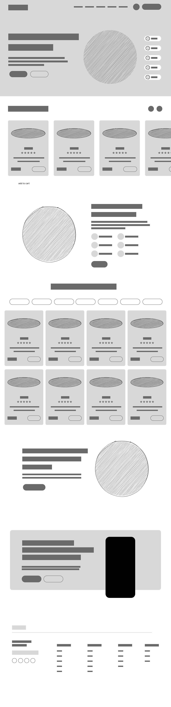
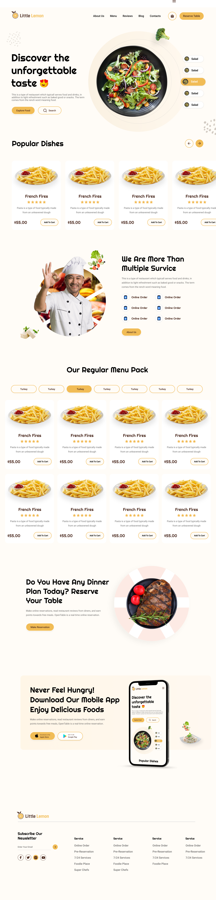
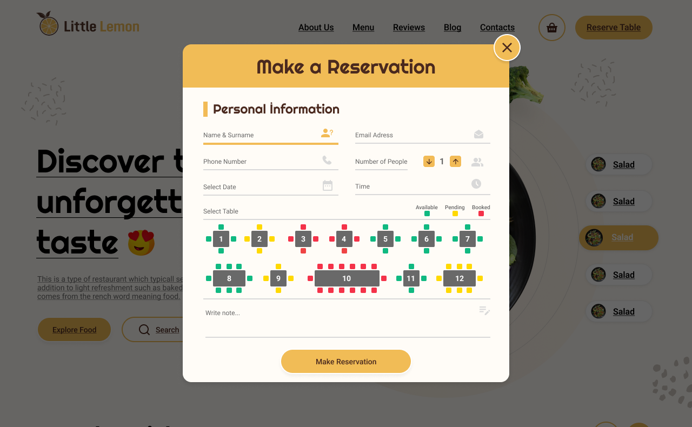
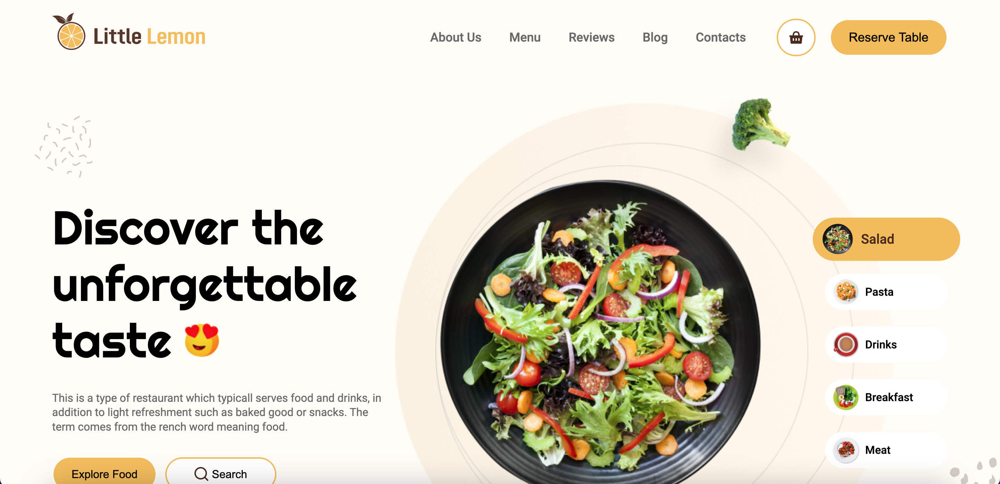

# Little Lemon - Reustorant & Booking

## Table of Content

- [Introduction](#introduction)
- [Preparatory Sage](#preparatory-sage)
    - [Wireframe](#wireframe)
    - [UI Design](#ui-design)
- [Features](#features)
- [Screenshots](#screenshots)
- [Technologies](#technologies)
- [Installation](#installation)

## Introduction

In this project, from the beginning with figma wireframe design and figma UI design, I created a restaurant website with ReactJS. I tried to use all the features of ReactJS. I made a table reservation system. (I Designed I Coded I Published).

## Preparatory Sage

---

### Wireframe

Show Wireframe

 

### UI Design

Show UI Design

---

## Features

- Book a table
- Order food online
- View menu

---

## Screenshots

---

## Technologies

- ReactJS
- HTML
- CSS 
---

## Installation

- Clone the repository
- Run `npm install`
- Run `npm start`
